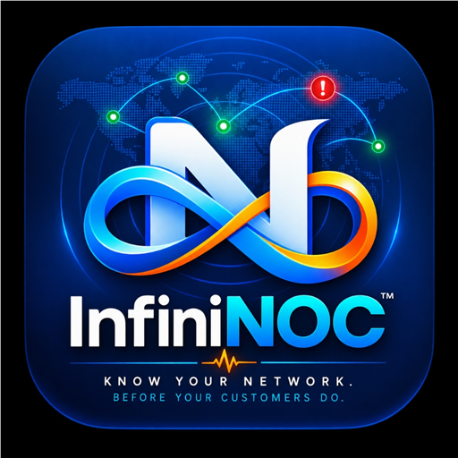

<div align="center">
    
    <h1>InfiniNOC</h1>
    <p><strong>Next-Gen Enterprise SaaS Network Operations Center & Infrastructure Telemetry Platform</strong></p>
    <p><em>"Know Your Network. Before Your Customers Do."</em></p>
    <p>Developed & Engineered by <strong>Infiniforge Technologies</strong></p>

    <p>
        <a href="#-quick-start--installation"></a>
        <a href="#-indian-saas--commerce-architecture"></a>
        <a href="#-carrier-grade-telemetry"></a>
        <a href="#-super-admin-control-plane"></a>
    </p>
</div>

---

## 🚀 Welcome to InfiniNOC

**InfiniNOC** is a high-performance, multi-tenant enterprise **Network Operations Center (NOC)** monitoring, telemetry, and SaaS platform designed specifically for Internet Service Providers (ISPs), Managed Service Providers (MSPs), Telecom Engineers, and Enterprise IT infrastructure teams.

Built with real-time WebSocket telemetry, reactive Vue 3 dashboards, SQLite/MySQL persistence, and first-class **Indian B2B SaaS architecture**.

---

## ⭐ Core Enterprise Features

### 🏢 1. Platform Super Admin Control Plane (`/super-admin`)
- **Separate Super Admin Portal**: Complete separation between platform administrators and organization tenants.
- **Tenant Management**: Create, edit, upgrade, suspend, or delete tenant organizations.
- **Organization Impersonation**: One-click secure Super Admin session impersonation with real-time banner notice.
- **SaaS Tier Pricing Builder**: Configure limits (*Max Monitors, Max Devices, Max Members, Status Pages*).
- **System Telemetry**: Real-time Node.js process RAM %, CPU load, database connections, and uptime diagnostics.
- **Platform Audit Logs**: Append-only security audit trail tracking admin impersonations and plan changes.
- **Global Governance**: Platform maintenance mode toggle, public self-serve signup switcher (`/signup`), and default trial period controls.

### 🇮🇳 2. Indian B2B SaaS & Commerce Engine
- **Indian Rupee (`₹`) Localization**: MRR, ARR, and plan pricing rendered natively in `₹` (INR) with `en-IN` numeric formatting.
- **18% Indian GST Invoicing**: B2B Tax Invoicing Engine with **HSN / SAC Code `998313`** (Cloud SaaS), CGST (9%) + SGST (9%) for intra-state and IGST (18%) for inter-state transactions.
- **Payment Gateways**: Native **Razorpay** Standard Checkout popup integration and **Cashfree** / Stripe gateway configurations.
- **Promotional Coupons**: Percentage (`%`) or fixed Rupee (`₹`) discount coupon code manager with redemption limits.

### 🛰️ 3. Carrier-Grade Telecom & Hardware Telemetry
- **GPON OLT Monitoring**: Real-time optical Tx/Rx power (dBm), ONU status, temperature, and port telemetry.
- **MikroTik RouterBoard OS**: CPU load, memory utilization, bandwidth throughput, and interface statistics.
- **Real-Time SNMP Tester**: Interactive **`[ ⚡ Test SNMP Connection ]`** diagnostic tool with OID varbind polling and latency metrics.
- **DNSBL Blacklist Protection**: IP Reputation & Mailserver MX Blacklist zone status checks with delisting instructions.
- **Multi-Protocol Monitoring**: HTTP(s), TCP Ping, DNS, WebSocket, gRPC, MQTT, Push, Docker Containers, and Databases (SQL Server, MySQL, Postgres, Redis, MongoDB).

### 📱 4. Mobile Responsive & PWA Native Experience
- **Responsive Mobile Drawer**: Off-canvas sliding drawer menu for seamless navigation on smartphones and tablets.
- **Header Theme Toggle**: Instant Light / Dark mode switcher button across all admin and tenant layout header bars.
- **Progressive Web App (PWA)**: Native standalone mobile app installation banner and Service Worker offline data caching.
- **White Label Customization**: Upload custom Header Logo, Favicon, Accent Colors, and Application Tagline.

---

## 🔧 Step-by-Step Installation Guide

### ⚡ Option 1: 1-Command Automated VPS Installer (Recommended)

Run this single command on any fresh **Linux VPS (Ubuntu / Debian / CentOS / AlmaLinux)** to automatically install Node.js, PM2, dependencies, build assets, and launch InfiniNOC live on port `3001`:

```bash
curl -fsSL https://raw.githubusercontent.com/abhishekaddepalli/InfiniNOC/main/install.sh | sudo bash
```

---

### Prerequisites (For Manual Installation)
- **Node.js**: `v18.0.0` or higher (`v20.x` or `v24.x` recommended)
- **npm**: `v9.x` or higher
- **Git**: `v2.x`

---

### Option 2: Quickstart Manual Setup (Node.js Local / Server)

1. **Clone Repository & Navigate to Directory**:
   ```bash
   git clone https://github.com/abhishekaddepalli/InfiniNOC.git
   cd InfiniNOC
   ```

2. **Install Dependencies**:
   ```bash
   npm install
   ```

3. **Build Frontend Bundle**:
   ```bash
   npm run build
   ```

4. **Start InfiniNOC Server**:
   ```bash
   node server/server.js
   ```

5. **Access Application**:
   - Open your browser and navigate to: `http://localhost:3001`
   - The first user account created automatically receives **Super Admin (`is_super_admin = 1`)** permissions.
   - Access the Super Admin Control Panel at: `http://localhost:3001/super-admin`

---

### Option 2: Production Deployment with PM2 (Recommended for Servers)

To keep InfiniNOC running continuously in the background on Linux / Windows servers:

1. **Install PM2 Globally**:
   ```bash
   npm install -g pm2
   ```

2. **Start InfiniNOC under PM2**:
   ```bash
   pm2 start server/server.js --name "infininoc"
   ```

3. **Configure PM2 Auto-Start on System Reboot**:
   ```bash
   pm2 save
   pm2 startup
   ```

4. **Check Server Status & Logs**:
   ```bash
   pm2 status
   pm2 logs infininoc
   ```

---

### Option 3: Docker Deployment

1. **Build Docker Image**:
   ```bash
   docker build -t infininoc:latest .
   ```

2. **Run Docker Container**:
   ```bash
   docker run -d \
     --name infininoc \
     --restart always \
     -p 3001:3001 \
     -v infininoc-data:/app/data \
     infininoc:latest
   ```

---

## ⚙️ Environment Configuration (`.env`)

You can create a `.env` file in the root directory to customize server ports and gateway keys:

```env
# Server Configuration
PORT=3001
NODE_ENV=production

# Razorpay Integration (India)
RAZORPAY_KEY_ID=rzp_live_YourKeyHere
RAZORPAY_KEY_SECRET=YourSecretHere
RAZORPAY_WEBHOOK_SECRET=YourWebhookSecretHere

# Platform Defaults
UPTIME_KUMA_PORT=3001
```

---

## 🏛️ Super Admin Portal Guide

- **Route**: `/super-admin`
- **First-Time Super Admin Setup**: Sign up for an account on initial launch. Account #1 is automatically granted `is_super_admin = 1`.
- **Super Admin Features**:
  - Manage Organizations (`/super-admin/organizations`)
  - Impersonate Tenant Accounts (`/super-admin/organizations`)
  - SaaS Plans & Quotas (`/super-admin/plans`)
  - GST Invoices (`/super-admin/invoices`)
  - Razorpay Gateway Setup (`/super-admin/gateways`)
  - White Label Branding (`/super-admin/branding`)
  - SMTP Email Configuration (`/super-admin/email`)
  - Platform Maintenance & Signups (`/super-admin/settings`)

---

## 📄 License & Ownership

Copyright © 2026 **Infiniforge Technologies**. All Rights Reserved.  
Engineered with ❤️ for ISPs, Telecom Engineers, and NOC Teams worldwide.
